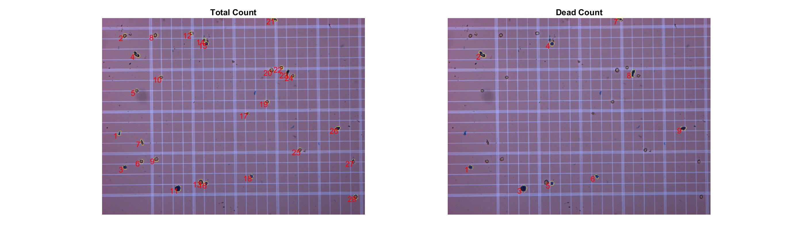

# Cellular Quantification

## [Report](Tech%20Report%203.pdf)

## Pipeline
**Filtering Noise:** hMSCs and endothelial cells images’ contrast was adjusted by histogram equalization using adapthisteq and histeq functions [1]. hMSCs was separated to blue signal (nucleus) and green signal (cell body). To further differentiate cell nucleus for hMSCs and, cell body for both cell types contrasted image was subtracted by blurred image. Blurred image was created by imfilter function. 

**Binarizing:** All images including hemocytometer images were then binarized by using imbinarize function with adaptive and numerical thresholding options [1]. Then additional small spots were removed by bwareaopen function [1]. Cells from hemocytometer were first converted to grayscale and isolated from the background grid by binarizing using numerical thresholding options. To normalize fuzzy dots around cell body imfill, imclose and imopen functions with strel morphological option [1]. For cells in hemocytemeter imerode and imdilate options were used to differentiate dead and alive cells [1].

**Masking:** hMSCs and endothelial cells were first separated from each other using morphological watershed method. Watershed method is an object separation technique that uses analogy of peaks and valleys. In this case, peaks and valleys were created by using the perimeter and the center of the cells in binary image [1]. 

**Counting and signals:** All cells were counted from their masks using bwlabel function. Signals were added by sum function and average was found from quotient of total signal and total number of cells. Standard deviation of signal was estimated by using std function. First, standard deviation was found per pixel of the masked area, then standard deviation was multiplied by ratio between total number of pixels from the masked area and total number of cells.

Avgsignal per cell=(Total Signal)/(Number ofcells)

Stdsignal per cell=(Total number of pixels in mask)/(Number of cells) Stdsignal per pixel

**Morphological analysis:** Morphology of endothelial cells were analyzed by finding area, perimeter, major and minor axes. Morphological data was obtained using regionprops function.

Circularity=4πArea/(perimeter)^2 

Aspect Ratio=(major axis)/(minor axis)  

**Viability:** Viability for the hemocytometer cells were found by separating dead and alive cells. Dead cells did not have a hole which allowed imerode function to separate dead from alive. Then viability % was computed by subtracting dead cell % from 100%. 

Viability %=100 (1-(dead cell count)/(total cell count)) 

## Figures

